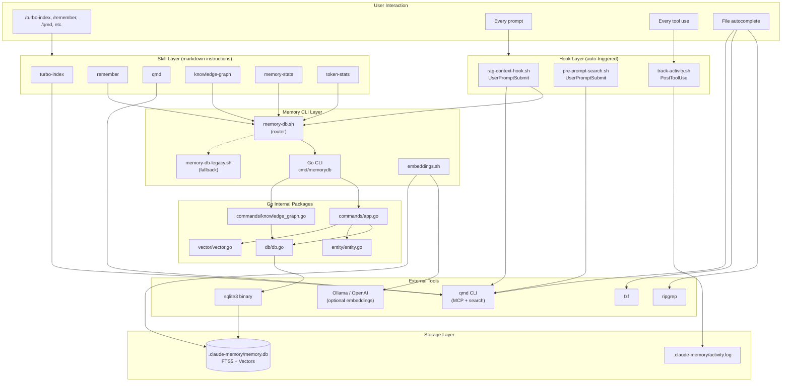
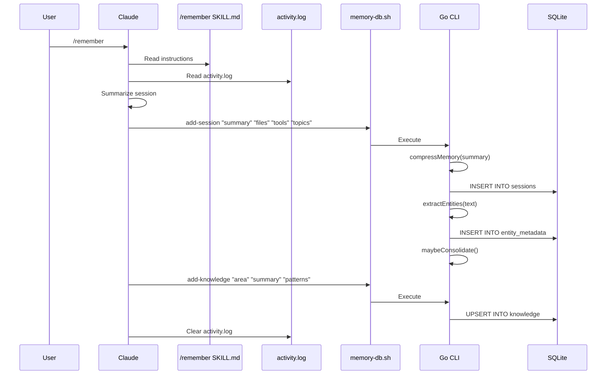
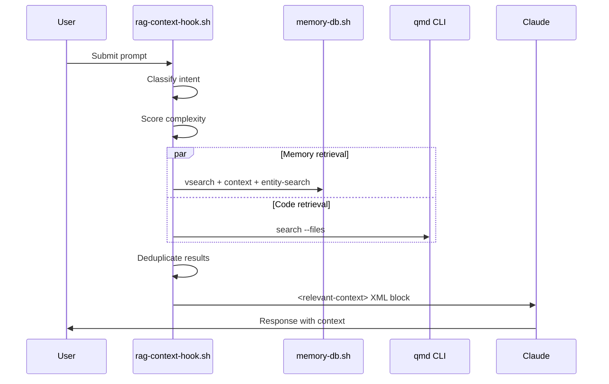

# Codebase Map

> Auto-generated by Cartographer. Last mapped: 2026-02-27

## System Overview



## Directory Structure

```
claude-turbo-search/
├── .claude-plugin/          # Local dev plugin registry
│   ├── marketplace.json
│   └── plugin.json
├── docs/                    # Documentation
│   ├── CODEBASE_MAP.md      # This file
│   ├── knowledge-graph-setup.md
│   └── plans/               # Design docs and screen specs
├── hooks/                   # Auto-triggered scripts
│   ├── pre-prompt-search.sh # Simple keyword search hook
│   ├── rag-context-hook.sh  # Full RAG pipeline hook
│   └── track-activity.sh    # Tool usage logger
├── memory/                  # Persistent memory system
│   ├── cmd/memorydb/        # Go CLI entry point
│   ├── internal/
│   │   ├── commands/        # Command handlers + TUI
│   │   ├── db/              # SQLite client (shells to sqlite3)
│   │   ├── entity/          # Regex entity extraction
│   │   └── vector/          # Cosine similarity math
│   ├── memory-db.sh         # Router: Go or legacy shell
│   ├── memory-db-legacy.sh  # Full Bash fallback
│   ├── embeddings.sh        # Embedding generation (Ollama/OpenAI)
│   ├── schema.sql           # Base schema (sessions, knowledge, facts, FTS5)
│   ├── schema-metadata.sql  # Entity metadata + relations
│   ├── schema-vector.sql    # Embedding columns + queue
│   └── schema-token-metrics.sql
├── scripts/                 # Setup and utility scripts
│   ├── install-deps.sh      # Cross-platform dependency installer
│   ├── setup-file-suggestion.sh
│   ├── setup-hooks.sh       # Hook installation wizard
│   ├── setup-mcp.sh         # QMD MCP server config
│   ├── setup-memory.sh      # Memory DB init
│   ├── setup-vector.sh      # Vector search wizard
│   └── file-suggestion.sh   # File autocomplete (installed to ~/.claude/)
├── skills/                  # User-facing slash commands
│   ├── knowledge-graph/     # /knowledge-graph
│   ├── memory-stats/        # /memory-stats
│   ├── qmd/                 # /qmd
│   ├── remember/            # /remember
│   ├── token-stats/         # /token-stats
│   └── turbo-index/         # /turbo-index
├── package.json             # Plugin manifest (declares skills)
├── marketplace.json         # agentskills.io listing
└── README.md
```

## Module Guide

### Memory CLI (`memory/`)

**Purpose**: Persistent memory system — stores sessions, knowledge, facts, entities, and embeddings in per-repo SQLite.

**Entry point**: `memory/memory-db.sh` (router)

| File | Purpose | Tokens |
|------|---------|--------|
| `memory-db.sh` | Router: dispatches to Go CLI or legacy shell | 407 |
| `memory-db-legacy.sh` | Full Bash+SQLite fallback implementation | 7,587 |
| `internal/commands/app.go` | All CRUD, search, analytics commands | 7,843 |
| `internal/commands/knowledge_graph.go` | ANSI TUI renderer (5 views) | 6,527 |
| `internal/db/db.go` | SQLite client via subprocess | 379 |
| `internal/entity/entity.go` | Regex entity extraction | 519 |
| `internal/vector/vector.go` | Cosine similarity math | 316 |
| `embeddings.sh` | Embedding generation (Ollama/OpenAI/Voyage) | 3,985 |

**Key commands**: `init`, `add-session`, `add-knowledge`, `add-fact`, `search`, `vsearch`, `context`, `consolidate`, `knowledge-graph`, `stats`, `token-stats`

**Design**: Zero external Go dependencies. SQLite accessed by shelling to `sqlite3` binary. Each `go run` uses build cache in `.claude-memory/.gocache/`.

### Hooks (`hooks/`)

**Purpose**: Auto-triggered scripts that inject context and track activity.

| File | Purpose | Trigger | Tokens |
|------|---------|---------|--------|
| `rag-context-hook.sh` | Full RAG pipeline with intent classification | UserPromptSubmit | 3,708 |
| `pre-prompt-search.sh` | Simple keyword search fallback | UserPromptSubmit | 740 |
| `track-activity.sh` | Logs tool usage to activity.log | PostToolUse | 880 |

**RAG pipeline flow**: Classify intent → Score complexity → Adjust budgets → Parallel retrieval (memory + QMD) → Deduplicate → Output XML context block.

### Scripts (`scripts/`)

**Purpose**: Setup and utility scripts for first-run configuration.

| File | Purpose | Tokens |
|------|---------|--------|
| `install-deps.sh` | Cross-platform dependency installer | 1,586 |
| `setup-hooks.sh` | Hook installation wizard (simple/RAG/memory modes) | 2,467 |
| `setup-file-suggestion.sh` | Install file autocomplete to ~/.claude/ | 647 |
| `setup-mcp.sh` | Configure QMD MCP server | 559 |
| `setup-memory.sh` | Initialize memory DB for current repo | 1,029 |
| `setup-vector.sh` | Interactive vector search setup | 2,718 |
| `file-suggestion.sh` | Live file autocomplete (rg+fzf+qmd) | 670 |

### Skills (`skills/`)

**Purpose**: Markdown instruction files that Claude interprets as slash commands.

| Skill | Command | Purpose | Tokens |
|-------|---------|---------|--------|
| turbo-index | `/turbo-index` | Full project setup (deps, hooks, QMD index) | 1,476 |
| remember | `/remember` | Save session to persistent memory | 1,312 |
| qmd | `/qmd` | Search-first workflow instructions | 680 |
| knowledge-graph | `/knowledge-graph` | Visualize entity graph, timeline, stats | 423 |
| token-stats | `/token-stats` | Token economics dashboard | 1,965 |
| memory-stats | `/memory-stats` | Memory DB statistics | 282 |

### SQLite Schema

**Base tables** (`schema.sql`): `sessions`, `knowledge`, `facts`, `memory_fts` (FTS5 virtual table with porter stemming)

**Optional extensions**:
- `schema-metadata.sql`: `entity_metadata`, `entry_relations`
- `schema-vector.sql`: `embedding` BLOB columns, `embedding_queue`, `vector_meta`
- `schema-token-metrics.sql`: `token_metrics`

## Data Flow

### Session Save (`/remember`)



### RAG Context Injection (every prompt)



## Conventions

- **Go**: Zero external deps, subprocess-based SQLite, ANSI escape codes for terminal output
- **Shell**: `set -e` in all scripts, per-repo `.claude-memory/` for data isolation
- **Skills**: Markdown with YAML frontmatter, contain Bash command templates for Claude to execute
- **SQL**: `db.SQLQuote()` for string escaping, `HasTable()` for optional schema detection
- **Entity extraction**: Regex-based (files, CamelCase concepts, dash-separated packages)
- **Memory compression**: Strip fillers, normalize dates, collapse whitespace

## Gotchas

1. **SQL injection**: Uses `SQLQuote()` (single-quote escaping) not parameterized queries — by design since DB client shells out to `sqlite3`
2. **Vector search is brute-force**: Loads all embeddings into memory for cosine comparison, no ANN indexing
3. **`go run` on every invocation**: First run after file changes is slow (~1-3s), then cached
4. **FTS entries not cleaned on consolidate**: Merged sessions don't update FTS — only deletes trigger FTS cleanup
5. **Embedding generation is slow**: `embeddings.sh` pipes each float through python3+base64+xxd individually
6. **`knowledge-graph-setup.md` references deleted Python file**: Docs may reference `knowledge_graph.py` which was replaced by Go

## Navigation Guide

**To add a new CLI command**: Add case to `memory/internal/commands/app.go:Execute()`, add to `CORE_COMMANDS` in `memory/memory-db.sh`, implement method on `App` struct

**To add a new skill**: Create `skills/<name>/SKILL.md` with YAML frontmatter, add path to `package.json` skills array

**To add a new hook**: Create script in `hooks/`, update `scripts/setup-hooks.sh` to register it in `~/.claude/settings.json`

**To modify entity extraction**: Edit `memory/internal/entity/entity.go` regex patterns

**To add a new DB table**: Create `schema-<name>.sql`, add `CmdInit<Name>()` to `app.go`, add to `memory-db.sh` CORE_COMMANDS

**To change RAG retrieval behavior**: Edit `hooks/rag-context-hook.sh` — intent patterns in `classify_intent()`, budgets in `route_retrieval()`
